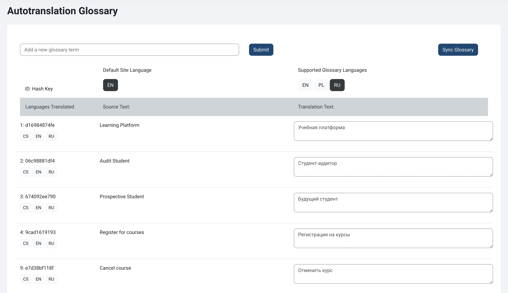

# Moodle Autostranslate Filter

[](https://github.com/jamfire/moodle-filter_autotranslate/releases)
[](https://github.com/jamfire/moodle-filter_autotranslate/actions/workflows/moodle-ci.yml)

## Installation

-   Unzip the plugin in the moodle .../filter/ directory.

This plugin is in an Alpha state and it is highly recommended that you backup your database before installing and enabling this plugin.

## Non-destructive translation

This autotranslation filter does not alter the original text of any of your content on Moodle. It stores all source text and translations in a translation table. The filter works by retrieving the source text from the translation table after it has been saved for the first time. If in the event something goes arwy, disable the filter and all of your original text will be restored immediately.

You need to consider your database performance and size when using this plugin. It will effectively double the size of your database if every page of your Moodle site is visited because all source text is being saved as a reference.

## Multlang support

This plugin provides limited support for [multilang](https://docs.moodle.org/403/en/Multi-language_content_filter) and [multilang2.](https://moodle.org/plugins/filter_multilang2). A custom parser has been written to find existing translations on your website and store those in the autotranslate table instead of fetching new translations from DeepL. This requires that you have only used a single {mlang} tag per translation in your content using the following format:

```
{mlang en}Hello{mlang}
{mlang es}Hola{mlang}
{mlang fr}Bonjour{mlang}
```

This filter does not support the following structure:

```
Moodle
{mlang en}Hello{mlang}
{mlang es}Hola{mlang}
{mlang fr}Bonjour{mlang}
{mlang en}Goodbye{mlang}
```

The word Moodle would be stripped out from your translation and you would end up with the words Hola, Bonjour, Goodbye in the translation table. The first Hello would be lost because of the duplicate "en" key.

## DeepL integration and plugin settings

This plugin uses DeepL to autotranslate content on your Moodle site into any of the languages that DeepL supports. The source language is always your Moodle default site language. The target language are any of the languages that are not your default site language.

You can signup for a free or pro version key of DeepL's [API.](https://www.deepl.com/pro-api). This plugin utilizes the official [DeepL PHP client library](https://github.com/DeepLcom/deepl-php) for connecting to the API. **You will need to enter your DeepL API key under the Autotranslate filter settings before this filter will work.**


## Enable the filter and move it to the top

-   Go to "Site Administration &gt;&gt; Plugins &gt;&gt; Filters &gt;&gt; Manage filters" and enable the plugin there.
-   It is recommended that you position the Autotranslate Filter at the top of your filter list and enable it on headings and content.

## Autotranslation scheduled task

There are two scheduled tasks that run every minute that can be configured in the Autotranslate Filter settings. The first task is an autotranslate job that translates any content loaded that is not your Moodle default site language. For example, if someone selects Spanish in the language switcher, and the default language of Moodle is in English, each line of text of the page visited will be queued for autotranslation. In the first minute after content on a page has been queued, the default site language will be served but after the autotranslate job has finished, the autotranslated version of the page will be served and become available for editing on the Autotranslation Management screen. By default, 200 strings are translated per minute using this scheduled task.

## Autotranslation management

This filter provides a string management interface for translators to manually adjust autotranslations at `/filter/autotranslate/manage.php`. If the identical string shows up in multiple places on your Moodle site, you only need to translate the string once. This is useful for items like blocks, additional navigation, etc. You can select the different contexts you want to translate under the Autotranslate filter settings.


You can also find a link in each course to translate only the content found in the course under "More &gt;&gt; Manage Autotranslations."


## Glossary sync task

The second scheduled task syncs a local copy of your Autotranslation glossary to DeepL for any [language combinations supported by DeepL.](https://www.deepl.com/docs-api/glossaries). You can manage your glossaries at `/filter/autotranslate/glossary.php`. To create a sync job, you will need to click "Sync Glossary" on the Glossary Management page for the selected source and target language pair.


